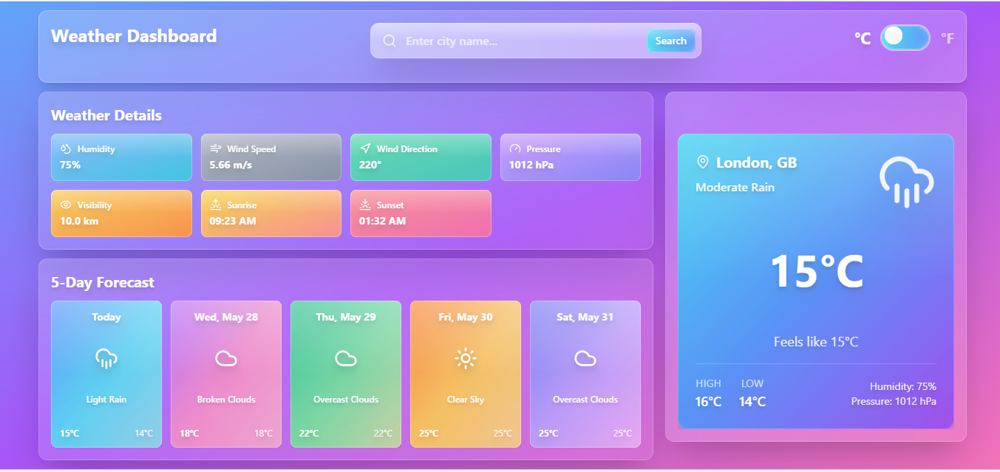
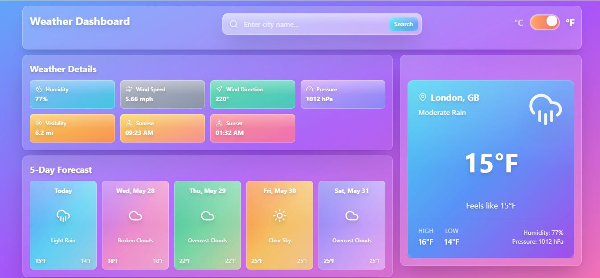
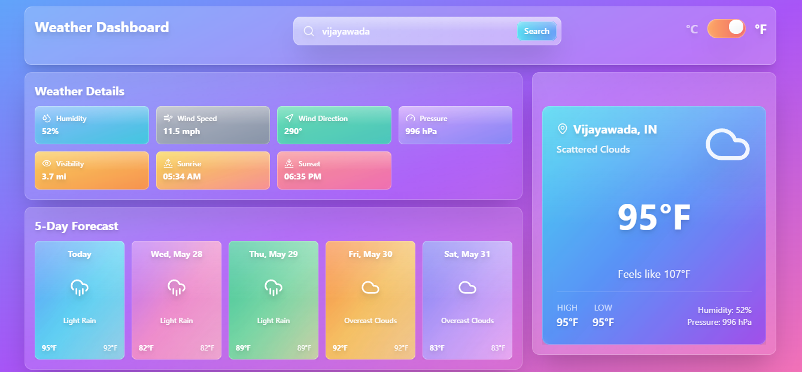

# Weather App 🌤️

A beautiful, modern weather application built with React that provides real-time weather information with stunning glassmorphism UI design.

## Features ✨

- **Real-time Weather Data**: Get current weather conditions for any city worldwide
- **Beautiful UI**: Modern glassmorphism design with gradient backgrounds and blur effects
- **Responsive Design**: Works seamlessly on desktop, tablet, and mobile devices
- **Unit Conversion**: Switch between Celsius and Fahrenheit temperature units
- **Weather Icons**: Dynamic weather icons that match current conditions
- **Detailed Information**: Display temperature, humidity, pressure, and "feels like" temperature
- **Location-based**: Shows city name and country information

## Tech Stack 🛠️

- **React** - Frontend framework
- **Lucide React** - Beautiful icons library
- **Tailwind CSS** - Utility-first CSS framework
- **OpenWeatherMap API** - Weather data provider (assumed)

## Installation 🚀

1. Clone the repository:
```bash
git clone https://github.com/Sravanthi-Chandrala/Weather-Dashboard.git
cd weather-app
```

2. Install dependencies:
```bash
npm install
```

3. Create a `.env` file in the root directory and add your OpenWeatherMap API key:
```env
REACT_APP_WEATHER_API_KEY=your_api_key_here
```

4. Start the development server:
```bash
npm start
```

5. Open [http://localhost:3000](http://localhost:3000) to view the app in your browser.

## Usage 📱

1. **Search for a city**: Enter any city name in the search bar
2. **View weather details**: See current temperature, weather conditions, and additional metrics
3. **Toggle units**: Switch between Celsius (°C) and Fahrenheit (°F)
4. **Enjoy the visuals**: Experience the beautiful glassmorphism design with dynamic weather icons

## API Setup 🔑

This app uses the OpenWeatherMap API to fetch weather data. To get started:

1. Visit [OpenWeatherMap](https://openweathermap.org/api)
2. Sign up for a free account
3. Generate an API key
4. Add the API key to your `.env` file as shown in the installation steps

## Project Structure 📁

```
src/
├── components/
│   └── weather/
│       └── WeatherCard.jsx
├── utils/
│   └── weatherIcons.js
├── App.js
└── index.js
```

## Component Features 🎨

### WeatherCard Component

The main weather display component featuring:

- **Glassmorphism Design**: Semi-transparent background with blur effects
- **Gradient Backgrounds**: Beautiful cyan to purple gradient overlay
- **Responsive Layout**: Flexbox-based layout that adapts to different screen sizes
- **Weather Icons**: Dynamic icons that change based on weather conditions
- **Typography Hierarchy**: Well-structured text sizes and weights for optimal readability

### Key Visual Elements

- **Glass Effect**: `backdrop-blur-sm` with `bg-white/10` overlay
- **Shine Effect**: Gradient overlay for realistic glass appearance
- **Drop Shadows**: Text shadows for better contrast and depth
- **Border Styling**: Subtle white borders with transparency

## Customization 🎨

### Changing Colors

Modify the gradient colors in the WeatherCard component:

```jsx
// Current gradient
<div className="absolute inset-0 bg-gradient-to-br from-cyan-400/80 via-blue-500/80 to-purple-600/80 rounded-xl"></div>

// Custom gradient example
<div className="absolute inset-0 bg-gradient-to-br from-pink-400/80 via-red-500/80 to-orange-600/80 rounded-xl"></div>
```

### Adding New Weather Data

Extend the WeatherCard to display additional weather information:

```jsx
// Add wind speed
<p className="text-white/90 text-sm drop-shadow-md">
    Wind: {weather.wind.speed} m/s
</p>

// Add visibility
<p className="text-white/90 text-sm drop-shadow-md">
    Visibility: {weather.visibility / 1000} km
</p>
```

## Contributing 🤝

1. Fork the repository
2. Create your feature branch (`git checkout -b feature/AmazingFeature`)
3. Commit your changes (`git commit -m 'Add some AmazingFeature'`)
4. Push to the branch (`git push origin feature/AmazingFeature`)
5. Open a Pull Request

## License 📄

This project is licensed under the MIT License - see the [LICENSE](LICENSE) file for details.

## Acknowledgments 🙏

- [OpenWeatherMap](https://openweathermap.org/) for providing the weather API
- [Lucide React](https://lucide.dev/) for the beautiful icons
- [Tailwind CSS](https://tailwindcss.com/) for the utility-first CSS framework
- Inspiration from modern glassmorphism design trends

## Support 💬

If you have any questions or run into issues, please:

1. Check the [Issues](https://github.com/Sravanthi-Chandrala/Weather-Dashboard.git) page
2. Create a new issue if your problem isn't already listed
3. Provide detailed information about your environment and the issue

## Screenshots 📸

### Main Weather Display


### Responsive Design - Desktop & Mobile
<div align="center">
  
  
</div>

### Different Weather Conditions
<div align="center">
  
  
  
</div>

### Temperature Unit Toggle


### Search Functionality


---

**Built with ❤️ using React and modern web technologies**